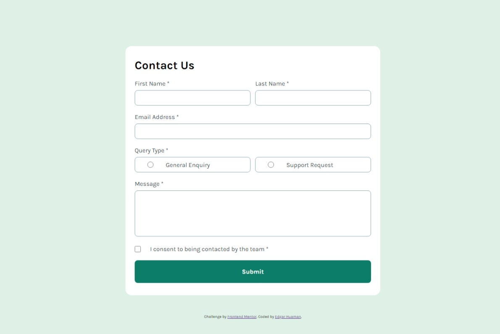

# Frontend Mentor - contact-form solution

This is a solution to the [Blog preview card challenge on Frontend Mentor](https://www.frontendmentor.io/challenges/blog-preview-card-ckPaj01IcS). Frontend Mentor challenges help you improve your coding skills by building realistic projects. 

## Table of contents

- [Overview](#overview)
  - [The challenge](#the-challenge)
  - [Screenshot](#screenshot)
  - [Links](#links)
- [My process](#my-process)
  - [Built with](#built-with)
  - [What I learned](#what-i-learned)
  - [Continued development](#continued-development)
  - [Useful resources](#useful-resources)
- [Author](#author)
- [Acknowledgments](#acknowledgments)

## Overview

### The challenge

Users should be able to:

- See hover and focus states for all interactive elements on the page
- View the content of the page on devices with 370 px.


### Screenshot



### Links

- Solution URL: [https://github.com/EdgarHuamanPE/contact-form]
- Live Site URL: [https://edgarhuamanpe.github.io/contact-form/]

## My process

### Built with

- Semantic HTML5 markup
- CSS custom properties
- Flexbox
- Grid
- Mobile-first workflow
- Methodology BEM
- JS
- Regular expressions (regex)


### What I learned

I learned to use grid layout for page layout responsive.
Use the BEM methodology.
validar email con expresiones regulares en js


```html
    <form action="#" class="formulario__form" method="get">
      <div class="formulario__control formulario__control--texto">
      </div>
      <div class="formulario__control formulario__control--texto">
      </div>
      <div class="formulario__control formulario__control--texto">
      </div>
      <div class="formulario__control formulario__control--radio">
      </div>
      <div class="formulario__control formulario__control--txtarea">
      </div>
      <div class="formulario__control formulario__control--checkbox">
      </div>
      <div class="formulario__control formulario__control--submit">
      </div>
    </form>
```
```css
.formulario__form{
    display: grid;
    grid-template-columns: repeat(2, 1fr);
    column-gap: 2%;
}

.formulario__control--texto:nth-child(1){
    grid-column-start: 1;
    grid-column-end: 3;
}

.formulario__control--texto:nth-child(2){
    grid-column-start: 1;
    grid-column-end: 3;
}

.formulario__control--texto:nth-child(3){
    grid-column-start: 1;
    grid-column-end: 3;
}

.formulario__control--radio{
    grid-column-start: 1;
    grid-column-end: 3;
}

.formulario__control--txtarea{
    grid-column-start: 1;
    grid-column-end: 3;
}

.formulario__control--checkbox{
    grid-column-start: 1;
    grid-column-end: 3;
}

.formulario__control--submit{
    grid-column-start: 1;
    grid-column-end: 3;
}
```
```js
  const emailRegex = /^[^\s@]+@[^\s@]+\.[^\s@]+$/;
  const emailaddress=document.querySelector("#emailaddress");
  const validemailaddressreq=document.querySelector(".formulario__errmessage--emailaddress");
  const validemailaddressval=document.querySelector(".formulario__errmessage--emailaddressvalid");

   /*set state of component */
    validemailaddressreq.style.display="none" ;
    emailaddress.style.border="1px solid var(--Grey-500)"; 
    validemailaddressval.style.display="none";
    /* show message error */
    if(emailaddress.value.trim()===""){
        validemailaddressreq.style.display="block" ;
        emailaddress.style.border="1px solid var(--Red)";
    }else{
        if(!emailRegex.test(emailaddress.value)){
            validemailaddressval.style.display="block" ;
            emailaddress.style.border="1px solid var(--Red)";
        }
    }
```

### Continued development

Create webpages with animations and interactions.

### Useful resources


## Author

- Website - [Add your name here]
- Frontend Mentor - [@EdgarHuamanPE](https://www.frontendmentor.io/profile/EdgarHuamanPE)
- Twitter - [@yourusername](https://www.twitter.com/yourusername)


## Acknowledgments


